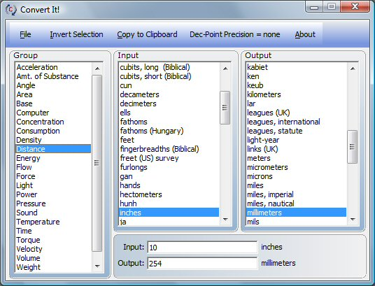



## Convert\_It\!

### Description

is an easy to use unit conversion program that will convert the most popular units of acceleration, angle, distance, temperature, volume, time, velocity, weight, power, density, pressure, energy, number base and many others, including the ability to create custom conversions. It also remembers the last user input for each group. 

----

(UPDATE: 6/1/11 - Added special conversion for liter/100km)
 
### More Info
 

             |
---                |---
**Submitted On**   |2011-05-31 15:15:08
**By**             |[Morgan Haueisen](https://github.com/Planet-Source-Code/PSCIndex/blob/master/ByAuthor/morgan-haueisen.md)
**Level**          |Advanced
**User Rating**    |4.7 (141 globes from 30 users)
**Compatibility**  |VB 6\.0
**Category**       |[Complete Applications](https://github.com/Planet-Source-Code/PSCIndex/blob/master/ByCategory/complete-applications__1-27.md)
**World**          |[Visual Basic](https://github.com/Planet-Source-Code/PSCIndex/blob/master/ByWorld/visual-basic.md)
**Archive File**   |[Convert\_It220542612011\.zip](https://github.com/Planet-Source-Code/morgan-haueisen-convert-it__1-64508/archive/master.zip)

